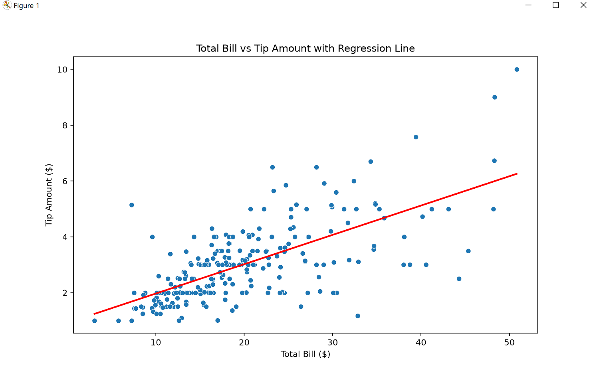
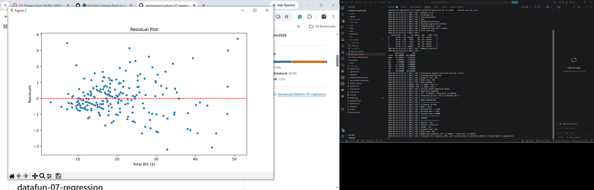

# Custom-07-regression

[](https://nwmgraspr.github.io/pro-analytics-02/workflow-b-apply-example-project/)
[](./pyproject.toml)
[](./LICENSE)

> Professional Python project: linear regression and predictive analytics.

## Project Goal

## Restaurant Tips Regression Analysis

Overview
This project analyzes whether a restaurant's total bill amount can predict the tip left by customers using simple linear regression.
Business Question:
Can the total bill amount be used to predict the tip left by customers?
Dataset
•	Source: Seaborn Tips Dataset 
•	Feature: total_bill 
•	Target: tip 

## Features

•	Loads and explores the Tips dataset 
•	Calculates correlation between bill amount and tip amount 
•	Fits a simple linear regression model 
•	Evaluates model performance using: 
o	R² (R-squared) 
o	RMSE (Root Mean Squared Error) 
o	Residual analysis 
•	Creates: 
o	Scatter plot with regression line 
o	Residual plot 
•	Predicts tip amount for a sample bill of $50 


## Technologies

•	Python 
•	Pandas 
•	NumPy 
•	Seaborn 
•	Matplotlib 
•	Scikit-learn 

## Run the Application

uv run python -m datafun.app_tips_case
## Expected Output

The program displays:
•	Dataset summary statistics 
•	Correlation between bill and tip 
•	Regression equation 
•	Predicted tip amount 
•	R² and RMSE metrics 
•	Regression and residual plots 

## Learning Objectives

•	Exploratory Data Analysis (EDA) 
•	Linear Regression Modeling 
•	Model Evaluation 
•	Residual Analysis 
•	Data Visualization 

## Author:

Your Name: Ralph Massaquoi
June 2026

### In a VS Code terminal

```shell
uv self update
uv python pin 3.14
uv lock --upgrade
uv sync --extra dev --extra docs --upgrade

uvx pre-commit install

git add -A
uvx pre-commit run --all-files
# repeat if changes were made
uvx pre-commit run --all-files

# do chores
uv run python -m pyright
uv run python -m pytest
uv run python -m zensical build

# save progress
git add -A
git commit -m "update"
git push -u origin main
```

</details>

## Notes

- Use the **UP ARROW** and **DOWN ARROW** in the terminal to scroll through past commands.
- Use `CTRL+f` to find (and replace) text within a file.
- You do not need to add to or modify `tests/`. They are provided for example only.
- Many files are silent helpers. Explore as you like, but nothing is required.
- You do NOT not to understand everything; understanding builds naturally over time.

## Example Output

```shell
2026-06-25 00:05:16 | INFO | P07 | Correlation between total_bill and tip: 0.6757
2026-06-25 00:05:16 | INFO | P07 | Creating modeling view
2026-06-25 00:05:16 | INFO | P07 | Original rows: 244
2026-06-25 00:05:16 | INFO | P07 | Model rows: 244
2026-06-25 00:05:16 | INFO | P07 | Rows dropped: 0
2026-06-25 00:05:16 | DEBUG | P07 | X shape: (244, 1)
2026-06-25 00:05:16 | DEBUG | P07 | y shape: (244,)
2026-06-25 00:05:16 | INFO | P07 | Fitting linear regression model
2026-06-25 00:05:16 | INFO | P07 | Regression Equation:
2026-06-25 00:05:16 | INFO | P07 | tip = 0.105025 * total_bill + 0.920270
2026-06-25 00:05:16 | INFO | P07 | Predicted tip for a bill of $50.00: $6.17
2026-06-25 00:05:16 | INFO | P07 | ====================
2026-06-25 00:05:16 | INFO | P07 | MODEL EVALUATION
2026-06-25 00:05:16 | INFO | P07 | ====================
2026-06-25 00:05:16 | INFO | P07 | R-squared: 0.4566
2026-06-25 00:05:16 | INFO | P07 | RMSE: 1.0179
2026-06-25 00:05:16 | INFO | P07 | Residual Min: -3.1982
2026-06-25 00:05:16 | INFO | P07 | Residual Max: 3.7434
2026-06-25 00:05:16 | INFO | P07 | Residual Mean: 0.0000
2026-06-25 00:05:17 | INFO | P07 | ====================
2026-06-25 00:05:17 | INFO | P07 | SUMMARY
2026-06-25 00:05:17 | INFO | P07 | ====================
2026-06-25 00:05:17 | INFO | P07 | Dataset: tips
2026-06-25 00:05:17 | INFO | P07 | Feature: total_bill
2026-06-25 00:05:17 | INFO | P07 | Target: tip
2026-06-25 00:05:17 | INFO | P07 | Original Rows: 244
2026-06-25 00:05:17 | INFO | P07 | Model Rows: 244
2026-06-25 00:05:17 | INFO | P07 | Regression Equation: tip = 0.105025 * total_bill + 0.920270
2026-06-25 00:05:17 | INFO | P07 | Interpret the R-squared, RMSE, and residual plots to determine whether a linear model is appropriate.
2026-06-25 00:05:33 | INFO | P07 | Regression workflow complete
2026-06-25 00:05:33 | INFO | P07 | ========================
2026-06-25 00:05:33 | INFO | P07 | Executed successfully!
2026-06-25 00:05:33 | INFO | P07 | ========================
```

## See visual finding below


## Tips: Is there a linear relationship?





## World Data: Is there a linear relationship? How can you improve the analysis?


